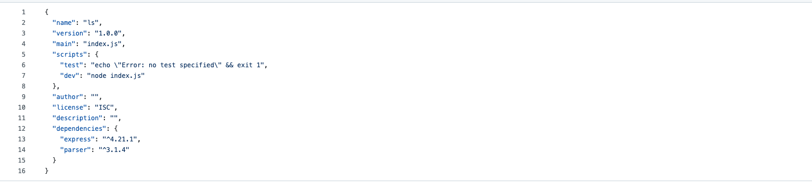
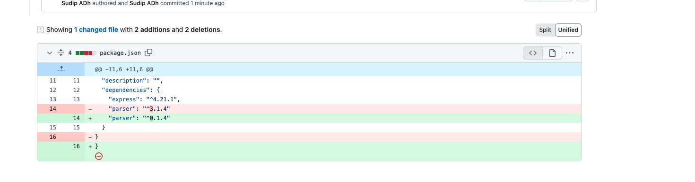

# kodey-cli-npm-demo-sample

This repository is an example Kodey.ai CLI workflow for managing and fixing NPM dependencies in a JavaScript project.

## Objectives

This sample demonstrates how Kodey.ai can automate the testing and fixing of an npm project. Here, we have intentionally placed an incorrect version of a dependency (`parser`) to trigger an error. Kodey.ai will detect the issue, update the dependency, and verify successful installation.

## Project Setup & Steps 
1. Sign up for a Kodey.ai account or log in to your existing Kodey.ai environment.
2. Set up your Kodey.ai integrations for the desired issue tracker and cloud git provider.
3. Fork this repository and clone it into your preferred cloud git provider (GitHub, Azure DevOps, Bitbucket).
4. Ensure you have a dev branch. If not, create one as Kodey will create new branches based on the dev branch.
5. Create a sample issue in your issue tracker using the issue description below.
6. Execute the prompt in the Kodey.ai chat UI.
7. Validate the commits and pull requests in your git repository.

## Intended Error
we have intentionally placed an incorrect version of a dependency (`parser`) to trigger an error.


### SAMPLE PROMPT - Fix NPM Dependencies for JavaScript Project

```
    platform: github | azure | bitbucket | gitlab

    repository-to-work-on: kodey-cli-npm-demo-sample

    branch name to create: fix/kodey-package-fix-final

    programming language: javascript

    Information to agent: Do as the steps below are defined one by one. You are working in <platform> repo so make sure to use tools related to <platform> repo.

    NOTE: Implement actual code changes as needed, not just comments. You are testing the npm project installation and fixing any dependency issues.

    Steps:

    step 1: Create a new branch with the name <branch name to create> and perform the following steps.

    step 2: Using the repo cloner tool, clone the repository.

    step 3: Using the command execution tool, execute `npm install` and check for any dependency issues. Run commands sequentially, not with `&&`.

    step 4: If any dependency issues are found, update the affected package to the latest compatible version using the CLI tool to retrieve the package's latest version information.

    step 5: After determining the correct version, install it with `npm install [package-name]@[version-number]` before modifying files.

    step 6: Re-run `npm install` to confirm the issue is resolved.

    step 7: If everything installs correctly, update the `package.json` file on GitHub with the fixed dependency information.

    step 8: Submit a pull request from the new branch to the main branch with an appropriate title.

    step 9: Update this Jira issue status to DONE.
```

## Confirming Successful Sample Outputs

1. Ensure the branch is created and visible on the associated issue or work item.
2. Validate the code changes in the pull request, confirming that the dependency version updates are applied as specified in `package.json`.
3. Verify that the issue or work item is marked as DONE or CLOSED in the issue tracker.

## Explanation

Kodey.ai follows these steps to troubleshoot and fix dependency issues:

1. **Branch Creation**: Kodey creates a branch based on the specified branch name.
2. **Repository Cloning**: Kodey clones the repository.
3. **Dependency Installation**: The agent executes `npm install`, identifying any dependency issues.
4. **Dependency Resolution**: If issues are found, Kodey locates and installs the correct version.
5. **Re-Testing**: Kodey verifies that all dependencies install without errors.
6. **Pull Request Creation**: After successful testing, Kodey commits the changes and opens a pull request.

## Example thought process by kodey:
*The initial npm install command identified a version mismatch for the parser dependency. I’ll retrieve the latest version of parser and replace the outdated one. Re-running npm install should verify the installation.*

*No issues remain after updating the dependency. The final step is to update package.json on GitHub and create a pull request from the fix/kodey-package-fix-final branch.*

## Result
At the end, you should see a pull request resembling this:

